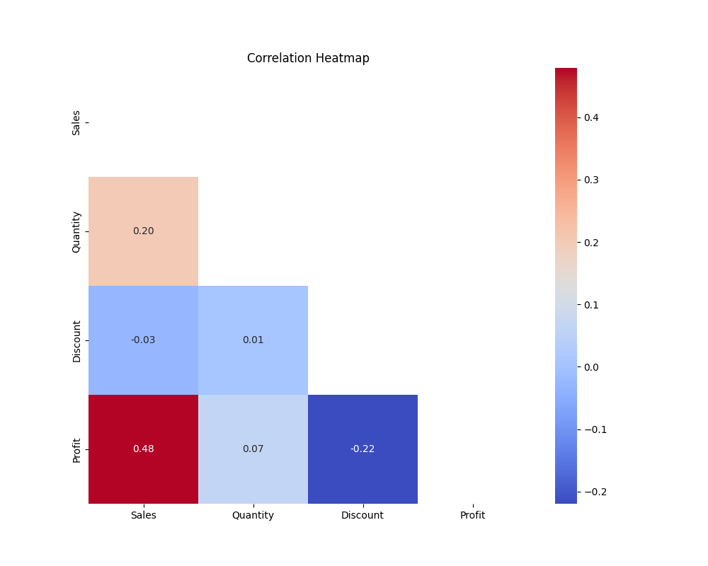
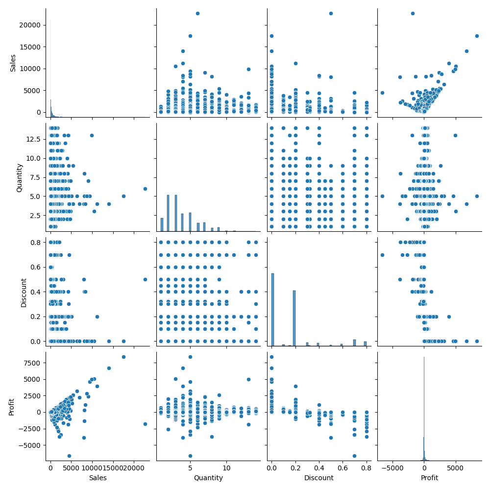

# 🔗 Correlation Analysis Project

## Overview
This project analyzes relationships between numerical variables using correlation analysis and visualization techniques.

## Analysis Performed
- Computed correlation matrix
- Visualized correlations using heatmap (with masking and annotations)
- Created pairplots to analyze relationships
- Identified strongest positive and negative correlations

## Key Insights
- Sales and Profit show a moderate positive correlation (0.48)
- Discount has a negative impact on Profit (-0.22)
- Other variables show weak relationships

## Visualizations
  

## Conclusion
The analysis highlights how sales contribute to profit while discounting strategies may reduce profitability.

## Tools Used
Python, Pandas, Matplotlib, Seaborn
